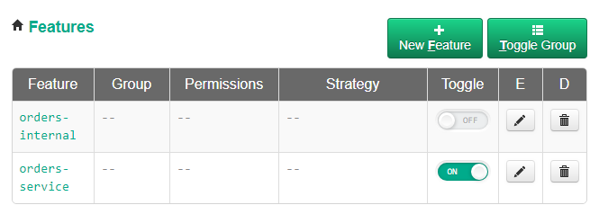

# Backend V2 for TicketMonster

This sub-project serves as the backend for the tm-ui-v2 project. Please note, that there is no concrete route from tm-ui-v2 to this backend, instead the access to this backend is fully controlled via routes in OpenShift. Follow the instructions in this document to learn how to configure this project.

This version of the backend employs *feature flags* to control the data flow between the backend itself and the extract [orders-service](../orders-service/). 


## How to use Feature Flags for Java (FF4J) 
1. Add FF4J dependency to pom.xml
    ```xml
    <dependency>
        <groupId>org.ff4j</groupId>
        <artifactId>ff4j-core</artifactId>
        <version>${ffj4.version}</version>
    </dependency>
    ```

1. Define feature flag(s) in ./src/main/resources/ff4j.xml
    ```xml
    <?xml version="1.0" encoding="UTF-8" ?>
    <features xmlns="http://ff4j.org/schema"
            xmlns:xsi="http://www.w3.org/2001/XMLSchema-instance"
            xsi:schemaLocation="http://ff4j.org/schema http://ff4j.org/schema/ff4j-1.4.0.xsd">
    <feature uid="orders-internal" enable="false"  description="Continue with legacy orders implementation" />
    <feature uid="orders-service" enable="true"  description="Call new orders microservice" />
    </features>
    ```

1. Add class FF4jFactory.java to package ./src/main/java/org/jboss/examples/ticketmonster/util**
    ```java
    @ApplicationScoped
    public class FF4jFactory implements FF4jProvider{

        private static FF4j rc = new FF4j("ff4j.xml");

        @Produces
        public static FF4j ff4j(){
            return rc;
        }

        @Override
        public FF4j getFF4j() {
            return rc;
        }
    }
    ```

1. (After a deployment of backend-v2) See FF4J console
    ```
    https://backend-v2.<yourClusterUrl>/ff4j-console
    ```

## Edit the BookingService 
In order for the ```BookingService``` to communicate with the ```OrderService``` we have to modify the URL.
In ```backend-v2\src\main\java\org\jboss\examples\ticketmonster\rest\BookingService.java```
edit the line:
```java
private String ordersServiceUri = "http://<YOUR-ORDER-SERVICE-URL>/rest/bookings";    
```


## Configure and deploy the application (backend-v2)

1. Modify the database credentials in standalone.xml as in backend-v1
    ```xml
    ...
    <connection-url>jdbc:mysql://${env.MYSQL_SERVICE_HOST}:${env.MYSQL_SERVICE_PORT}/ticketmonster?useSSL=false</connection-url>
    ...     
    ```

1. Build the application with Maven
    ```
    mvn clean install -P mysql fabric8:build -D docker.image.name=<YOURDOCKER>/backend-v2:latest
    ```
1. Exchange Dockerfile in \target\docker\<YOURDOCKER>\backend-v2\latest\build\Dockerfile
exchange with new version to fix permission errors
    ```dockerfile
    FROM jboss/wildfly:10.1.0.Final 
    EXPOSE 8080

    COPY maven $JBOSS_HOME/

    USER root

    #Give correct permissions when used in an OpenShift environment.
    RUN chown -R jboss:0 $JBOSS_HOME/ && \
        chmod -R g+rw $JBOSS_HOME/

    USER jboss
    ```
1. Build the Docker image
    ```
    docker build . -t <YOURDOCKER>/backend-v2:latest
    ```
1. Push the image to Dockerhub
   ```
    docker push <YOURDOCKER>/backend-v2:latest
   ```
1. Create new application in OpenShift
    ```
    oc new-app --docker-image=<YOURDOCKER>/backend-v2:latest -e MYSQL_SERVICE_HOST=yourhost -e MYSQL_SERVICE_PORT=yourport
    ```
1. Expose the backend to create publicly available URL
    ```
    oc expose svc/backend-v2
    ```

## Verify FF4J console

In your browser, navigate to the FF4J console at ```http://backend-v2-m2m.<yourclusterurl>/ff4j-console```. The output should look similar to the screenshot:

 


<!--
oc import-image backend-v2:latest --from=jetzlstorfer/backend-v2:latest
-->