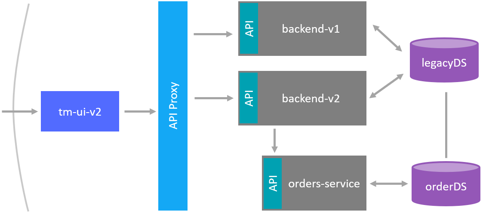

# OrderService as a Microservice for TicketMonster

This sub-project contains the microservice OrdersService that deals with TicketMonster's bounded conext of booking event tickets. It has its own data model as specified in ```./mysql-scripts/orders-schema.sql```. To extend the data model to the microservice's domain model, the Teiid framework is used in the code. This framework allows to create a virtual database view on the top of multiple databases. In case of OrdersService the legacy database of the monolith and its own database are merged to a virtual view.

## Setup and configure the Orders database

1. Create a new MySQL service in OpenShift
    ```
    oc new-app mysql:5.5 --name=orders-mysql -e MYSQL_USER=ticket -e MYSQL_PASSWORD=monster -e MYSQL_DATABASE=orders
    ```
1. Copy file with schema information and data to the DB pod
    ```
    oc rsync src/main/resources/db/migration/ <your-db-pod>:/var/lib/mysql
    ```
1. Connect to the DB pod and execute SQL statements
    ```bash
    oc rsh <your-db-pod>
    mysql -u root orders < V1__0_ordersdb-schema.sql
    mysql -u root orders < V1__1_ordersdb-data.sql
    ```
By the end of this steps, you have a dedicated MySQL database named `orders` with the schema set up and the needed data inserted.

## Configure and deploy the application


1. Edit the database connection strings in the ```\src\main\resources\application-mysql.properties``` file:
    ```properties
    spring.datasource.legacyDS.url=jdbc:mysql://<yourticketmonsterdb>:3306/ticketmonster?useSSL=false
    spring.datasource.legacyDS.username=ticket
    spring.datasource.legacyDS.password=monster
    spring.datasource.legacyDS.driverClassName=com.mysql.jdbc.Driver

    spring.datasource.ordersDS.url=jdbc:mysql://<yourorderdb>:3306/orders?useSSL=false
    spring.datasource.ordersDS.username=ticket
    spring.datasource.ordersDS.password=monster
    spring.datasource.ordersDS.driverClassName=com.mysql.jdbc.Driver
    ```
1. Build the application with Maven
    ```
    mvn clean install -P mysql,kubernetes fabric8:build -D docker.image.name=<yourdocker>/orders-service:latest -D skipTests
    ```
1. Build the Docker image in ```\target\docker\<your dockerhub account>\orders-service\latest\build\```
    ```
    docker build . -t <yourdocker>/orders-service:latest
    ``` 
1. Push the application to Dockerhub
    ```
    docker push <yourdocker>/orders-service:latest
    ```
1. Create a new application in OpenShift
    ```
    oc new-app --docker-image=<yourdocker>/orders-service:latest
  	```

By the end of this steps, you have the `orders` service in place. In order to actually call this service, set the according feature flag in your FF4J console. Read more on this in the [backend-v2](../backend-v2/) sub-project.


The following figure shows this approach from a conceptual point of view:

