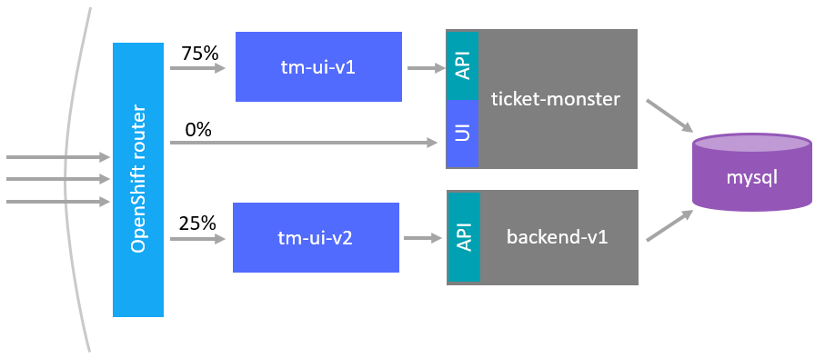

# Ticket Monster UI-V2

This version of the frontend is configured to communicate with the ```backend-v1``` service.

<!-- getting rid of config due to switch to env variables
## Configuration

This proxy helps us keep friendly URLs even when there are composite UIs or composite microservice REST APIs
It also helps us avoid tripping the browser Same Origin policy. We use a simple HTTP server (apache) to serve the static content and then use the reverse proxy plugins to proxy REST calls to the appropriate microservice:

```conf
# proxy for the admin microserivce
ProxyPass "/rest" "http://backend:8080/rest"
ProxyPassReverse "/rest" "http://backend:8080/rest"
```

## Build

```
docker build . -t <YOURDOCKER>/ticket-monster-ui-v2:latest
docker push <YOURDOCKER>/ticket-monster-ui-v2:latest
```
-->

## Deploy & Expose

```
oc get routes
oc new-app -e BACKENDURL=<yourbackendurl> --docker-image=jetzlstorfer/ticket-monster-ui-v2:latest
oc expose service ticket-monster-ui-v2 --name=ui-v2
```

## Canary release

Edit the route in OpenShift according to the amount of traffic you want to send to the new service.
For example, send 75 % of the traffic to ```ticket-monster-ui-v1``` and 25 % to ```ticket-monster-ui-v2``` via the production route. Over time, this value can be adjusted.

```
oc set route-backends production ticket-monster-ui-v1=75 ticket-monster-ui-v2=25
```


The following figure shows this approach from a conceptual point of view:



